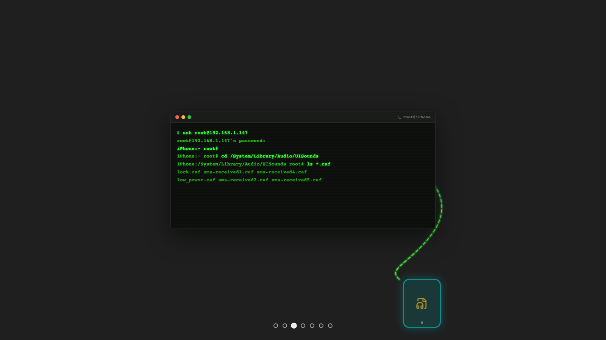
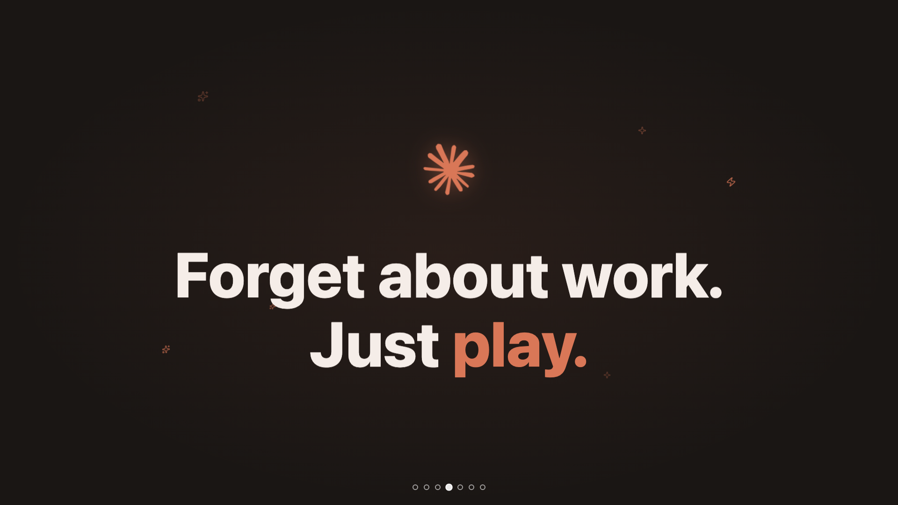
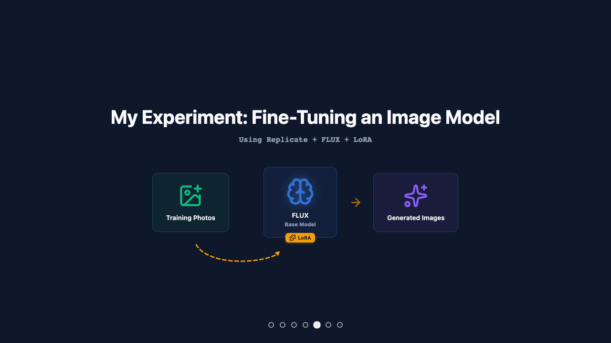
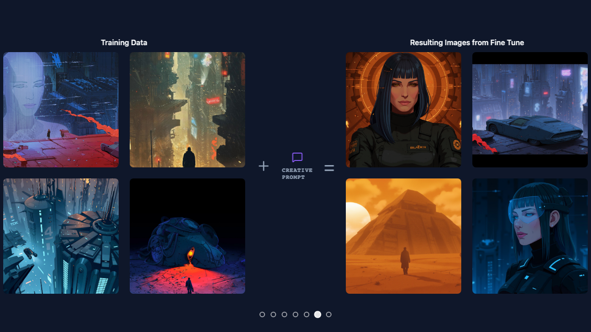
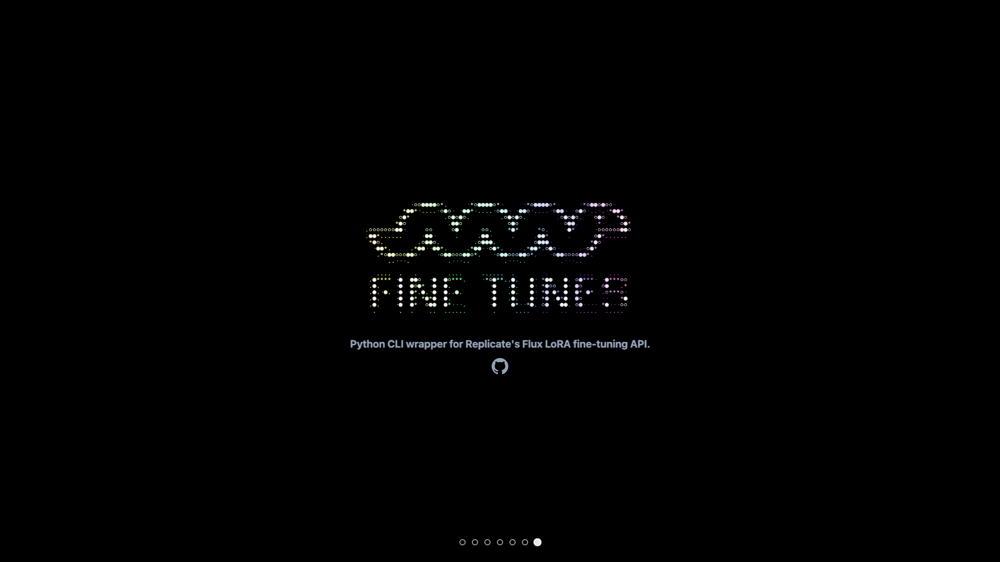

Done in collaboration with [@lindsaylee](https://github.com/lindsaylee) on an AI Test Kitchen series. Exploring tips, tricks and ways to get started using AI for designers.


A presentation about experimentation, curiosity, and the unexpected paths that lead us somewhere new.

Built as a custom React + Vite slide deck.

---

## The Story

### Two Worlds


My degree was in drawing, painting, and representational art. I didn't own a computer until I was twenty-five.

---

### The Thing That Bugged Me


The original iPhone came out. I hated every single sound it made. Then I discovered my iPhone needed to be "jailbroken." I bought the phone, why is it in jail? That kicked me off trying to get root access just to swap one MP3 file.

---

### Down the Rabbit Hole



So here I am, phone tethered to the iMac, SSHing into root. Trying to figure out what SSH even is, what the numbers on the other side of the @ mean, how to get to where I can swap out one file. I spent days trying different angles until I finally got through.

---

### Forget About Work. Just Play.



The text tone itself was insignificant compared to the journey of exploration it opened up. Find that spark. Something that makes you curious, delights you, or feels like it needs to be fixed. And run with it. Don't worry about knowing how. Just explore and create.

---

### The Experiment



A recent experiment for me was fine-tuning an image model on Replicate. You teach an existing model to recognize a new visual concept, like an art style, by feeding training photos through a lightweight adapter called a LoRA. Out come images that blend what the model already knows with what you just taught it.

---

### The Results



10 training images of Blade Runner 2049-style concept art, a creative prompt, and the model spit out entirely new compositions in that same style. Moody neon cityscapes, silhouetted figures, cinematic light. The whole thing ran on Replicate's infrastructure. No GPUs to configure, no ML expertise required.

---

### Go Build Something



I created a Python CLI app where anyone can pull it down, give it training images, and generate a fine-tune. Least friction possible, so people can find their own spark.

---

### The Model: Android Dream v4

**[View on Replicate](https://replicate.com/interfaceconjurer/android-dream-v4)** · **[Source Code](https://github.com/interfaceconjurer/fine-tunes)**

A custom Flux LoRA trained on painterly illustrated poster art inspired by Blade Runner 2049. The style features atmospheric cyberpunk cityscapes with dramatic scale: tiny silhouetted figures dwarfed by massive holographic projections and towering brutalist architecture. Bold warm-vs-cool color palettes (orange and red ground planes against blue-teal structures), heavy atmospheric perspective, soft diffused edges, and moody god rays cutting through fog.


| Property        | Value              |
| --------------- | ------------------ |
| Trigger Word    | `BLADED`           |
| Training Steps  | 2000               |
| Training Images | 7 captioned images |
| Cost            | ~$1.50             |
| Training Time   | ~20 minutes        |

<table>
  <tr>
    <td></td>
    <td></td>
    <td></td>
  </tr>
  <tr>
    <td></td>
    <td></td>
    <td></td>
  </tr>
</table>

---

## Running Locally

```bash
npm install
npm run dev
```
